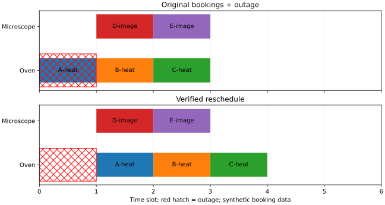
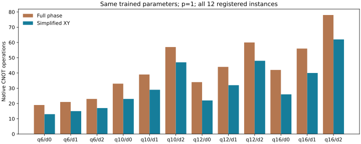
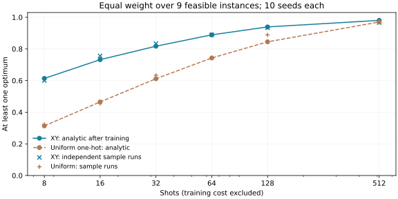

# 从小规模求解走向可审计的故障重排

队伍：youshen。数据均为合成；CPU 无噪声模拟。增强版保留原有显式候选接口，
新增可证明的线路精简、安全化简和原问题回填、原始数据 MILP、CSV 预约导入，
并以冻结语料记录失败边界。贡献是这些环节在应用中的实现、证明与验证，
不把 QAOA、XY 混合器、约束传播或 MILP 称为原创算法。

## 1. 三分钟业务演示

先按[主教程](README.md#1-三分钟演示)安装环境，在仓库根目录执行：

```bash
OMP_NUM_THREADS=1 OPENBLAS_NUM_THREADS=1 MPLBACKEND=Agg .venv/bin/python pyqpanda-algorithm/example/LabScheduling/booking_demo.py
```

输出 `reports/booking-demo/`：

- `outage-input.json` / `control-input.json`：CSV 展开后的完整候选，含尚未剪枝项。
- `outage-report.json` / `control-report.json`：QUBO、传播原因、量子样本与双经典认证。
- `changes.csv`：原预约、调整后预约、偏好成本、变更成本、原因。
- `booking-changes.svg`：原预约与调整后的静态甘特图；红色阴影表示故障。

默认结果：停机后目标值 **6**、**3** 张预约改动、**0** 约束违反；
无故障对照目标值 **0**，全部保留。原问题 10 个候选，日历剪枝后 9 个；
传播固定三个烘箱任务，删除两个不兼容候选，剩余一个 **4 比特**量子组件。
四比特组件实际运行 QAOA；传播解决的任务明确记作经典预处理。
烘箱上的后两张预约原本没有碰到停机，但被迫连锁后移，不能提前冻结它们。



导入模板：[chain.csv](../../pyqpanda-algorithm/example/LabScheduling/data/bookings/chain.csv)，
日历：[outage.json](../../pyqpanda-algorithm/example/LabScheduling/data/bookings/outage.json)。
CSV 必须使用模板列序，`allowed_resources` 以 `|` 分隔，
`earliest/latest` 是含端点的整数开始窗口，`step >= 1`。
每个设备与窗口网格的笛卡尔积全部展开；`shift_cost * abs(start-original_start)`
是偏好成本，再按是否改约加 `change_cost`。设备兼容性由允许设备列显式表达。
CSV 最多展开 256 个原始候选；超限报错，不能静默删候选。
这是透明导入入口，尚无真实用户试用或隐私数据。

## 2. 删除 XY 相位里的恒零罚项

设任务域为 $D_t$，$N_t=\sum_{i\in D_t}x_i$，完整 QUBO
$Q=C+A\sum_t(N_t-1)^2+A\sum_{(i,j)\in E}x_ix_j$。
W 初态在 $N_t=1$ 的子空间中；对角成本相位和域内 XY 交换都保持每个 $N_t$。
因此每一步演化可达的子空间内，$\sum_t(N_t-1)^2=0$。
将成本相位换为 $C+A\sum_E x_ix_j$，保留同一个缩放 $A$，
在无噪声、同参数、相同初态与混合器条件下得到相同的测量分布。
Ising 实现略去的常数只影响全局相位。

`build_circuit(..., phase_mode="auto")` 默认仅对 XY 精简；`"full"` 保留旧相位。
X 混合器会离开恰选一次子空间，必须使用完整相位，auto/full 对 X 相同。
完整 `Model.energy`、罚系数、优化损失和审计表不变。
优化器可能因浮点末位差异改变搜索路径，因此比较相同参数的线路分布，
不要求两个独立优化过程最终参数逐位相等。

每个被删除的同任务 ZZ 项节省本实现中的两个 CNOT，
节省数为 $2\sum_t\binom{|D_t|}{2}$。这是原生 PyQPanda3 操作计数，
CRY 单独保留，不等于面向某台硬件完整分解后的两比特门数。
不承诺带噪硬件等价，深度也未必严格下降。

| 已有样例，p=1 | CNOT full→auto | 原生深度 full→auto |
|---|---:|---:|
| simple | 34→22 | 36→24 |
| medium | 78→54 | 45→35 |

数学思想参考 [XY mixers, Wang 等](https://arxiv.org/abs/1904.09314)。
该项创新价值在于将约束子空间性质用于可审计的应用线路编译，不是新的通用混合器。

## 3. 安全传播、分量与回填

调用 `reduce_model(model)` 或 CLI 加 `--reduce`：

1. 某任务只有一个候选时，它在所有可行排程中必选；删除与它冲突的其他候选。
2. 重复直到没有新单候选。若出现空域，返回 `infeasible_task` 及删除链，证明不可行。
3. 将未固定任务按“仍存在不兼容候选对”连接成图，取连通分量。
4. 每分量使用原问题的资源、候选与内部前序重建 QUBO。
   删除的跨分量前序已对所有存活候选自动成立，否则会存在连边。
5. 每分量独立运行真实 CPU QAOA，将实际采到的最佳位串映回原变量，插回固定选择，
   再按原问题约束检查。报告还在原始未剪枝输入上独立检查最终预约。

**等价性**：删除规则只排除与必选候选冲突的选择，所以所有原可行排程保留；
固定点后没有跨组件禁止对，组件可行排程的笛卡尔积加固定选择，恰好等于原可行集合。
成本可加，$C_{original}=C_{fixed}+\sum_k C_k$，故组件精确最优值可相加。
QAOA 没有最优保证，组件近似解拼接后也不获得最优保证。
独立组件重算罚系数，因此不声称分解前后的量子分布相同。

`reduction.removals` 记录被删变量、`forced_by` 变量和冲突原因；
`component_to_original` 是回填映射，`fixed_cost` 单列固定成本。
单次从每个组件独立抽一份的可行概率为各组件可行概率之积；
报告中的该乘积不是“各自挑完最佳样本后的最终成功率”。
shots 是**每个组件**的预算，`total_shots=组件数×shots`。
与未分解模型比较时必须计算总预算。

单组件最多 16 比特；总候选可以超过 16，但不能把组件总和称为模拟器处理的量子规模。
大组件返回 `resource_limit`，CLI 退出码 **5**；不会截断或改用经典解假装量子输出。
若传播已解决全部任务，状态为 `classical_propagation`，线路评价次数为 0。
局部一致性不保证全局可行；默认路径只做单候选传播，没有支配剪枝。
后续加入可选 `--reduce --pruning arc`，按完整对方域删除无支持候选；
证明、审计字段、超限边界演示与已知语料对照见[弧一致性说明](ARC_PRUNING.md)。
本页历史评测仍对应默认单候选模式。

## 4. 独立 MILP 与证书边界

`solve_milp(problem, time_limit=30)` 从**原始未剪枝候选**独立建模：
每任务选择和为 1，日历无效选项的变量上界为 0，原始语义不兼容对满足
$y_i+y_j\le1$，目标为原始偏好与改约成本。它不导入 QUBO 编译器、冲突图或能量。
SciPy/HiGHS 求解后，以 `validate_assignment(problem, choices)` 再检查原始预约。
MILP 实现与其检查器共享原始语义辅助函数，但与 QUBO 编译/评估独立；
小实例还与完全枚举交叉验证，避免以一份编码自证正确。

状态分为 `optimal`、`infeasible`、`limit`、`error`。
达到时间限制时即便有可行 incumbent，也不标为最优；`dual_bound` 和 `gap`
分别返回，非有限/不可用值为 null。`time_limit` 仅限制求解器时间，
不包括模型构造。最多 2048 个原始 MILP 候选；配对构造 $O(n^2)$。
SciPy 的状态定义见[官方 milp 文档](https://docs.scipy.org/doc/scipy/reference/generated/scipy.optimize.milp.html)。

报告的枚举上限仍为一百万组合，超过则 `exact.status="budget_exceeded"`；
只有精确枚举或 MILP 的最优证书可用于计算最优差距，未认证时 gap=null。
不可行和有限抽样失败是不同状态。原生求解器有限精度证书不是形式化机器证明。

经典扩展检查：

```bash
OMP_NUM_THREADS=1 OPENBLAS_NUM_THREADS=1 .venv/bin/python pyqpanda-algorithm/example/LabScheduling/classical_scaling.py
```

20/35/50 任务的三种合成烘箱链，MILP 目标值为 40/71/100，均返回 optimal。
其最大连接组件分别为 59/104/149 候选，**没有执行量子求解**；
用于展示经典基线和资源边界，不是量子规模结果，也不代表一般调度性能。

## 5. 冻结语料与诚实比较

[实验协议](BENCHMARK_PROTOCOL.md)在首次评价前冻结生成规则、12 个实例和 10 个优化种子。
[manifest](../../pyqpanda-algorithm/example/LabScheduling/data/corpus/manifest.json)
含输入及生成器 SHA-256；开发样例与评价实例分开。
每个规模/拥挤格只有一个数据种子，因此该评价仍是探索性结果。

```bash
# 如需重建，生成器必须匹配冻结版本；不要根据求解结果筛选输入。
.venv/bin/python pyqpanda-algorithm/example/LabScheduling/make_corpus.py
OMP_NUM_THREADS=1 OPENBLAS_NUM_THREADS=1 .venv/bin/python pyqpanda-algorithm/example/LabScheduling/stress_benchmark.py --output reports/lab-enhanced
.venv/bin/python pyqpanda-algorithm/example/LabScheduling/summarize_benchmark.py reports/lab-enhanced --output reports/lab-evidence
```

120 次训练全部保留，穷举与原始 MILP 一致：9 个实例可行，3 个不可行。
可行实例中 86/90 个训练种子的单次最优概率高于均匀 one-hot，另 4 个退化；
9 个实例内部的种子平均值均较高，但不能把 90 个种子当作 90 个独立问题。
最差的 16 比特稀疏实例种子单次最优概率约 0.00077，低于均匀的 0.00391。
经典基线在这些规模更快，不宣称量子加速或普遍优势。





曲线计算 $P(hit\mid S)=1-(1-p_{opt})^S$，累计**全部并列最优态**的概率。
先在实例内平均 10 个种子，再在 9 个可行实例间等权平均；不可行实例仍留在原始记录。
交叉标记来自独立采样流的实际抽样；这些曲线都排除训练成本。
`quantum.runtime_seconds` 含训练、最终采样及求解器内可行性诊断，
额外分布认证与对照线路计入 `diagnostic_seconds`。
全程峰值 RSS 是 Linux 进程的累计高水位，不是某一线路或硬件内存需求。

查看[逐实例表](results/enhanced/SUMMARY.md)、
[120 次原始记录](results/enhanced/runs.jsonl)、
[代码与环境指纹](results/enhanced/provenance.json)。
原来的三种子图表位于 `results/`，是 schema 1 / full 相位的历史基线；
增强版 schema 2 默认精简 XY，不要求优化历史与旧版逐位相同。

## 6. 测试与后续工作

除原有 QUBO/Ising 全状态验证外，新增：100 个随机小实例对所有可行排程做无损回填，
再与原始 MILP 比较；simple/medium 各 30 组随机角度的 p=1/2/3 实际 CPU 等价检查；
单候选混合域、连锁改约、多个组件、组件超限、独立证书状态、CSV 错误输入和成本展开。
全部命令及安装证据见[验证记录](VALIDATION.md)。

下一步需要真实实验室的匿名数据与用户试用反馈，以及更多每格数据种子、
更大连通组件的资源策略；目前没有用真实需求反馈或通用量子优势来包装合成实验。
保留已有安全证明，比继续堆叠算法变体更有利于维护者理解和合并。

后续已补充[第二批异构评测](EVALUATION_V2.md)：36 个独立输入、每格 4 个数据种子、
360 条配对运行记录，以及三项改约决策全部留在量子组件内的业务案例。
上述 120 次归档仍保留原貌；真实用户验证和更大连通问题仍是限制。
