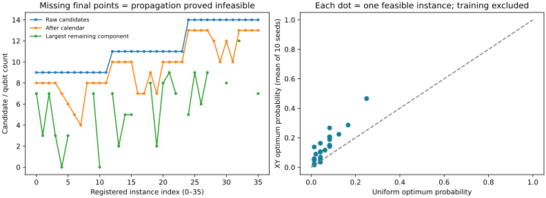
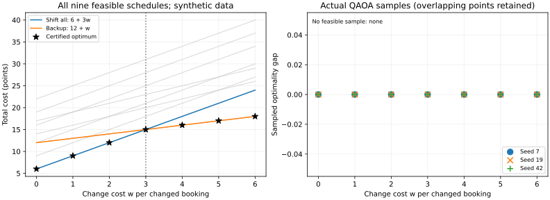

# 异构预约与逐阶段对照

本轮保持应用算法与默认参数不变。第一批 12 个实例/120 次训练继续保留，
第二批协议和生成数据在运行评价前以提交 `94efa84` 冻结。
所有数据仍为合成，没有据此声称真实业务部署或量子加速。

## 覆盖了什么

3/4/5 任务 × 单短故障/双延长故障/前序链故障 × 4 个独立数据种子，共 36 个实例。
每任务 2–4 个原始候选、时长 1–3、清洗时间 0–2，含跨设备选择和小组互斥。
所有无故障原预约均独立验证为合法且成本为 0，再加入故障；故障后的实例不筛选。
实际得到 24 个可行、12 个不可行问题，每个运行种子 0–9 的未分解和化简两条路径。

共 360 条配对种子记录，不等于 720 次实际量子训练：原始路径的空域以及化简后的
不可行或完全固定情形不会启动量子线路；一个分解请求也可能训练多个组件。
确切执行数、状态及逐实例预算见 [aggregate.json](results/v2/aggregate.json)
和 [summary.csv](results/v2/summary.csv)。

## 主要结果与退化

- 独立原始 MILP 与全部组合枚举对 36 个实例的可行性/最优值一致；
  日历剪枝与分量回填前后的**全部可行集合和成本**也逐个一致。
- 可行问题的 240 个未分解训练种子中，206 个最优态概率高于均匀 one-hot，
  34 个更低。`n4-s0-r2` 连实例内 10 个种子的平均值也低于均匀基线，明确保留。
- 512 shots 下，未分解路径 237/240 次命中最优；化简路径 240/240 次命中，
  其中 20 次是纯经典传播，且多个组件会增加总 shots/训练预算。
  **不能将这两个命中率作为同预算量子优势证据。**
- 12 个不可行问题全部被传播识别；未分解路径中 6 个因空域直接停止，另外 6 个
  仍执行量子训练后没有可行样本。后者由 MILP/穷举确认不可行，不能仅靠抽样失败认证。
- 未分解已训练线路 full/auto 同参数最大概率差为 `4.9961e-16` 以下。
  概率比较基于无噪声 CPU，不延伸为真机等价结论。
- 一次完整评价约 97.71 秒，含双路径训练、独立证书、组合证明和额外分布诊断；
  具体硬件/版本/代码指纹见 provenance。时间仅是本机观测，非性能承诺。
- 第二次完整重放的 36 份实例记录、360 份配对运行记录在仅剔除 `_seconds`
  字段后完全一致，详见 [replay.json](results/v2/replay.json)。



每格只含 4 个独立问题，故只提供逐实例结果及格内范围；一些故障格可行问题更少。
低 shots 曲线和独立抽样记录保存于每次训练的 `direct_metrics`，均排除训练成本。

## 资源节省来自哪一步

以固定登记的 `n5-s0-r0` 为例：

| 阶段 | 候选/量子资源 | 原生 CNOT（p=1） |
|---|---|---|
| 原始预约输入 | 14 个候选 | 不计：尚未编码日历无效候选 |
| 日历剪枝 | 13 比特 | 62 |
| 单候选传播 | 9 个剩余变量 | 见逐阶段记录 |
| 独立分量 | 2、5、2 比特；最大组件 5 比特 | 合计 29 |
| XY 精简相位 | 相同分量与变量 | 合计 17 |

单候选传播和分解改变模型罚系数及随机种子，不要求与原模型有相同量子分布；
只证明原问题可行集合/成本保持。分量是顺序执行的，组件最大深度仅描述资源上限。
某些问题分解后总训练次数或总运行时间上升；表格保留这些情况，不只展示成功节省。

## 业务案例：由量子组件完成实际取舍

[tradeoff.json](../../pyqpanda-algorithm/example/LabScheduling/data/tradeoff.json)
包含三个有前序关系、时长不同的实验，烘箱每次清洗 1 时隙。故障使 A 的原预约失效。
候选允许三单连锁后移（成本 12、改动 3 单），或使用昂贵备用设备（成本 14、改动 1 单）。
这也说明“加权成本最小”与“改约数量最少”不是同一目标。

剪枝后域大小为 2/3/3，没有单候选，三个任务仍在同一 8 比特组件。实际默认采样
选择成本 12 的解；完整 QUBO/精简相位的 CNOT 为 37/23，原生深度为 42/23。
无故障对照成本 0。所有 9 个可行方案见 [alternatives.csv](results/v2/tradeoff/alternatives.csv)，
采样证据、独立证书与图示见 [业务结果目录](results/v2/tradeoff/)。

## 复现

安装依赖后，在仓库根目录执行：

```bash
OMP_NUM_THREADS=1 OPENBLAS_NUM_THREADS=1 MPLBACKEND=Agg .venv/bin/python pyqpanda-algorithm/example/LabScheduling/tradeoff_demo.py
OMP_NUM_THREADS=1 OPENBLAS_NUM_THREADS=1 MPLBACKEND=Agg .venv/bin/python pyqpanda-algorithm/example/LabScheduling/benchmark_v2.py --output reports/lab-v2
OMP_NUM_THREADS=1 OPENBLAS_NUM_THREADS=1 MPLBACKEND=Agg .venv/bin/python pyqpanda-algorithm/example/LabScheduling/summarize_v2.py reports/lab-v2
```

生成器和输入内容不匹配冻结哈希时，评价入口直接报错。原始输出分为
`instances.jsonl`（每实例结构/经典证书）与 `runs.jsonl`（每种子两条求解路径），
以避免在每个种子中复制不变的输入与证书。全部运行记录均提交，未删去退化或失败项。

## 改约成本敏感性：什么时候值得使用备用设备

使用已有三工序案例，保持全部约束与候选不变，只把每项任务的改约成本统一设为
`w=0,1,2,3,4,5,6`。这是已知开发案例上的业务解释，不是新的留出评测或实际价格调查。
[协议](SENSITIVITY_PROTOCOL.md)与[输入及参数网格](../../pyqpanda-algorithm/example/LabScheduling/data/sensitivity.json)
在首次运行前以 `5ebcdc3` 提交冻结。原来的默认权重仍为 2。

每项任务 i 的成本为偏好费用加改约费用，
`C(w) = sum(preference_i) + w * changed_tasks`。
“整体后移”的偏好费用合计 6、改约三单，因此 `C_shift=6+3w`；
“备用设备”的偏好费用合计 12、改约一单，因此 `C_backup=12+w`。
二者在 `w=3` 相交。我们还枚举了全部原始候选组合，确认七组输入都有相同的
**9 个可行排程**；它们的完整成本曲线也纳入核验，不只比较这两个预选方案。

| 每单改约成本 w | 认证最优成本 | 认证最优决策 | 改约数量 | 三种子实际目标 |
|---:|---:|---|---|---|
| 0 | 6 | 整体后移 | 3 | 6 / 6 / 6 |
| 1 | 9 | 整体后移 | 3 | 9 / 9 / 9 |
| 2 | 12 | 整体后移 | 3 | 12 / 12 / 12 |
| 3 | 15 | 整体后移或备用设备，同优 | 3 或 1 | 15 / 15 / 15 |
| 4 | 16 | 备用设备 | 1 | 16 / 16 / 16 |
| 5 | 17 | 备用设备 | 1 | 17 / 17 / 17 |
| 6 | 18 | 备用设备 | 1 | 18 / 18 / 18 |



量子设置统一为 seed 7/19/42、p=1、2 restarts、maxiter=60、512 shots、XY、
默认单候选化简；三个任务始终留在一个 8 比特组件内，无固定任务。
全部 **21 次**实际量子结果零违反、最优差距为 0，随后经独立穷举与原始 MILP 认证。
图左灰线是全部可行排程的成本，星号是经典认证；图右是实际量子 gap，
重合点均保留。不能把图左解析曲线当作量子采样结果。

在 `w=3`，全枚举确认 `[1,1,1]` 与 `[2,0,0]` 两个原始候选索引组合都最优。
本次三个种子的最终选中解均为备用设备方案；这不排除整体后移同样最优，
也不表示量子结果均匀覆盖所有同优方案，或把“少改约”作为了额外优化目标。
评分接纳任意同优排程；报告重放则要求实际记录一致，二者是不同要求。

这解释了配置权重的业务含义：越重视避免改约，越可能接受更贵的备用设备。
`w=3` 是这个合成案例的阈值，成本单位是偏好分；不把它推广为真实实验室价格。
21 次命中也不改变[同预算实验](MATCHED_BUDGET.md)中经典随机持平或胜出的结论，
不声称量子加速或对任意问题有最优保证。

在原演示后加一个参数即可生成甘特图、成本曲线、七行表和全部记录：

```bash
OMP_NUM_THREADS=1 OPENBLAS_NUM_THREADS=1 MPLBACKEND=Agg .venv/bin/python pyqpanda-algorithm/example/LabScheduling/tradeoff_demo.py --sensitivity
```

结果位于 `reports/tradeoff-demo/sensitivity/`：`summary.csv` 是七行决策表，
`inputs/` 是七个派生输入，`results.json` 包含全部实际参数、counts、状态、
分项成本、认证、源码/输入指纹和环境；压缩排版以减少原始归档 diff。
基础 `tradeoff.json` 不被修改。有限抽样失败或非最优结果会保留，业务字段在无
可行样本时为 null，不以经典解替换；测试专门覆盖这些分支。

```bash
OMP_NUM_THREADS=1 OPENBLAS_NUM_THREADS=1 MPLBACKEND=Agg .venv/bin/python pyqpanda-algorithm/example/LabScheduling/tradeoff_demo.py --sensitivity --output reports/tradeoff-replay --verify-sensitivity reports/tradeoff-demo/sensitivity/results.json
```

第二次完整执行中七个输入、21 次参数/counts、全部可行集合与成本、源码/环境
指纹均复现；仅忽略 `_seconds` 字段，见[重放记录](results/sensitivity/replay.json)。
上述命令比较当前环境内的两次运行；若要严格核对已提交的历史归档，请按
[源码版本与环境说明](REVIEW_GUIDE.md#当前运行与历史归档如何核对)选择对应提交。
[归档决策表](results/sensitivity/summary.csv)与[完整记录](results/sensitivity/results.json)
对应实现 `51a5067`，可按其源码与锁定环境复现。
该增强仅涉及示例、测试、文档和聚焦 CI，核心包与默认量子参数不变。
