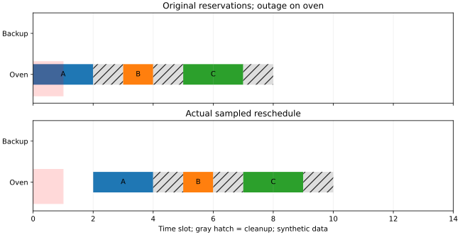
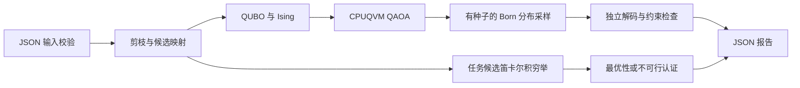

# LabReschedule：基于 QUBO 的共享实验室最小扰动重排

一台仪器临时停机，哪些实验必须改约，哪些预约可以保留？本应用把设备预约、
多时隙实验、清洗占用、小组冲突和工序先后关系编译为 QUBO，在 **PyQPanda3
CPUQVM** 上运行 QAOA，并用独立穷举与原始输入 MILP 给出可核查的最优性和不可行性结论。

面向 2026 本源杯开源创新赛道。数据均为合成场景，没有学生个人信息。
本项目交付的是可复用 Python 模块、命令行、输入样例、测试和实验记录。
小规模经典算法更快；这里验证量子建模及约束保持线路，不宣称量子加速。

首次阅读建议从[五分钟审阅路线](REVIEW_GUIDE.md)开始。下面的业务案例中，烘箱
故障后，三个实验可以整体后移，也可以租用备用设备来少改两单。成本权重决定
哪种方案更合适；三个决策均保留在 8 比特量子组件中。



图为已归档的默认案例运行，成本 12、零违反；运行 `tradeoff_demo.py` 可生成
当前版本的图与原始报告。完整比较、九种可行排程和权重切换见
[业务取舍与成本分析](EVALUATION_V2.md)。

| 要核验什么 | 入口 |
|---|---|
| 安装、JSON 输入、QUBO 推导与测试 | 本页第 1–8 节 |
| CSV 连锁改约、XY 相位精简、分量回填证明 | [增强教程](ENHANCEMENTS.md) |
| 相同训练与采样预算下的量子/随机比较 | [同预算评价](MATCHED_BUDGET.md)，含随机持平或胜出的结果 |
| 构造案例的 18→12 比特化简及适用边界 | [可选弧一致性](ARC_PRUNING.md) |
| 当前版本重复运行与历史归档的对应提交 | [重放说明](REVIEW_GUIDE.md#当前运行与历史归档如何核对) |
| 测试、安装兼容性与 CI 的实际验证范围 | [验证记录](VALIDATION.md)、[安装兼容性](COMPATIBILITY.md) |
| 使用自己的预约数据并记录使用反馈 | [小范围试用流程](USER_TRIAL.md)，目前仅完成合成演练 |

第一版的[历史开发基线图](results/overview.svg)保留供追溯。

## 1. 三分钟演示

在仓库根目录运行。推荐 **Python 3.12**（实际验证 3.12.3，WSL Linux x86_64）。
Python 3.11、3.12、3.13 均已通过 Linux x86_64 完整应用测试及 wheel 验证。
3.11 需要单独的约束文件，3.13 可沿用下方约束；具体版本与边界见
[安装兼容性](COMPATIBILITY.md)。首次下载依赖所需时间取决于网络。

```bash
python3.12 -m venv .venv
.venv/bin/python -m pip install \
  -c pyqpanda-algorithm/example/LabScheduling/constraints-py312.txt \
  -e ./pyqpanda-algorithm \
  -r pyqpanda-algorithm/example/LabScheduling/requirements-dev.txt
```

安装后，一条命令完成读入、剪枝、QUBO、量子求解、经典认证与报告保存：

```bash
OMP_NUM_THREADS=1 OPENBLAS_NUM_THREADS=1 .venv/bin/python -m pyqpanda_alg.LabScheduling pyqpanda-algorithm/example/LabScheduling/data/medium.json --output reports/medium.json
```

应看到 JSON 中 `status="feasible"`、`quantum.best.objective=4`、
`quantum.best.violation_count=0`、`exact.best.objective=4`、`absolute_gap=0`。
默认 seed=7、p=1、512 次最终采样、2 次参数初始化、每次至多 60 次优化评估。
运行时间在本机为数秒以内（含解释器及依赖导入）；耗时不是跨机器承诺。
不需要账户、API Key、GPU 或真实硬件。

若希望直接看到“原预约→故障→三单连锁改约”的 CSV 与甘特图，可运行：

```bash
OMP_NUM_THREADS=1 OPENBLAS_NUM_THREADS=1 MPLBACKEND=Agg .venv/bin/python pyqpanda-algorithm/example/LabScheduling/booking_demo.py
```

输出成本 6、3 张改约、0 违反，以及无故障对照成本 0；详见[增强教程](ENHANCEMENTS.md)。

评委建议演示顺序：

1. 运行上面的中等实例，查看四项实验日程及最优值 4。
2. 查看 `model.pruned`：停机剪掉两个候选，14 个输入候选降为 12 比特。
3. 查看 `model.variables`、`linear`、`quadratic`、`offset`，追溯比特到实际预约。
4. 运行同命令加 `--mixer x`，对比 `one_hot_probability`、可行概率及最优差距。
5. 把输入换为 `data/infeasible.json`，验证经典认证不可行、退出码为 3。
6. 运行第 8 节测试，核查数学恒等式、位序和真实量子模拟。

完整接口帮助：`.venv/bin/python -m pyqpanda_alg.LabScheduling --help`。
`--output` 会替换指定报告文件，请使用专用路径。若它与输入是同一路径，或通过
符号链接/硬链接指向同一文件，CLI 会在求解前拒绝并退出 2。报告先写入同目录的
临时文件，写完再替换；普通写入或替换失败会保留旧报告并清理临时文件。
有效输出符号链接保留，更新其目标报告。这不提供断电持久性或多进程写入事务保证。

报告 `input_sha256` 对应本次读取并求解的原始 UTF-8 字节，包括原换行形式；
求解期间外部修改或删除输入不会改变该指纹。复现时应保留对应输入版本。

## 2. 问题定义与实际价值

校园实验室的仪器是单位容量资源。实验不能拆分，实验结束后设备还需要清洗；
同一小组不能同时在两台设备操作。部分实验必须等前一道工序完成才能开始。
设备故障后，重新排一张可行表之外，还希望尽量保留原预约，降低协调成本。

应用关注有限时间窗口内的局部重排，而非整个学校的全年排课。调用者明确给出
每项任务允许的 `(设备, 开始时刻)` 候选；不同任务可有不同候选数量。
设备兼容性与人工确定的可用窗口通过候选集表达。一个任务只有一个小组标识；
不模拟可同时参加多个小组的个人。

- 仪器占用区间：`[start, start + duration + cleanup)`。
- 小组工作区间：`[start, start + duration)`，清洗不继续占用小组。
- 前序约束：`end(before) <= start(after)`，不等待前序设备的清洗结束。
- 区间为左闭右开，相邻边界可接续；设备清洗结束也必须不超过 horizon。
- 停机期间连清洗也不可发生。超时、停机候选在建模前删除，保留删除原因。
- 冲突设备/小组各为单位容量，无容量松弛变量。

这些定义明确区分设备和小组时间，避免“实验结束了，但设备还不能用”的漏排。

## 3. 输入格式

完整示例：[simple.json](../../pyqpanda-algorithm/example/LabScheduling/data/simple.json)、
[medium.json](../../pyqpanda-algorithm/example/LabScheduling/data/medium.json)、
[infeasible.json](../../pyqpanda-algorithm/example/LabScheduling/data/infeasible.json)。

```json
{
  "name": "单实验示例",
  "horizon": 6,
  "resources": [{"id": "instrument", "cleanup": 1, "downtime": [[0, 1]]}],
  "tasks": [{
    "id": "A", "group": "group-A", "duration": 2,
    "original": {"resource": "instrument", "start": 0},
    "change_cost": 3,
    "options": [
      {"resource": "instrument", "start": 0, "cost": 0},
      {"resource": "instrument", "start": 1, "cost": 1}
    ]
  }],
  "precedence": []
}
```

| 字段 | 语义 |
|---|---|
| `horizon` | 正整数，统一离散时隙的右边界 |
| `resources[].id` | 唯一设备名称 |
| `cleanup` / `downtime` | 默认 0 / []，非负整数清洗时间 / 停机区间 |
| `tasks[].id, group, duration` | 唯一任务名称、小组、正整数持续时间 |
| `options[].resource, start, cost` | 设备引用、非负开始时刻、非负整数偏好成本 |
| `original` | 可选原预约，可以因故障已不可用，不必仍在候选中 |
| `change_cost` | 默认 0；改变原设备或开始时间时一次性支付，有此成本须有 original |
| `precedence` | 默认 []，任务 ID 二元组 `[before, after]` |

时间和成本整数范围为 0–1,000,000（horizon/duration 至少为 1）。
拒绝重复 JSON 键、重复 ID/候选、未知字段和引用、负成本、浮点数、布尔整数和 NaN。
`tasks=[]` 定义为空排程且目标为 0；任务的 `options=[]` 是有效但不可行的问题。
前序成环也是有效但不可行的约束集合，交给精确基线认证。
`Problem.from_dict`、`load_problem` 和 `parse_problem(text)` 是输入校验入口；
`parse_problem` 可从内存中的 JSON 文本构造相同的严格验证结果，仍拒绝重复键和
非有限常量。直接构造内部数据类
的调用者须满足同样的不变量。

## 4. QUBO 建模与惩罚证明

对任务 $t$ 的存活候选集合 $D_t$，定义 $x_i\in\{0,1\}$；$x_i=1$
表示选择候选 $i$。索引按输入任务顺序、候选顺序生成，删去无效候选后连续编号。
变量 $i$ 就是量子比特 $i$，不通过字符串名字排序。

候选线性成本为

$$c_i=\text{preference}_i+
\text{change\_cost}_{t(i)}\,
\mathbf1[(r_i,s_i)\ne(r^0_{t(i)},s^0_{t(i)})].$$

没有原预约时第二项为零；这是加权扰动和偏好的联合目标，未声称按变更次数
进行词典序优化。硬约束包括：每任务恰选一次、设备及小组互斥、前序完成时间。
剪枝已满足所有候选自身的停机和时间边界约束。

令 $C$ 是不同任务之间不允许同时选择的候选对集合。即使同一对同时违反设备、
小组和前序规则，也只加入一个冲突对；解释报告保留全部原因。完整 QUBO 为

$$E(x)=\sum_i c_i x_i+
 A\sum_t\left(\sum_{i\in D_t}x_i-1\right)^2+
 A\sum_{(i,j)\in C}x_ix_j.$$

使用 $x_i^2=x_i$ 展开：常数 $A|T|$，线性系数 $c_i-A$；同任务不同候选的
二次系数 $2A$，不同任务冲突候选的二次系数 $A$。
`quadratic` **只储存 $i<j$ 的一次系数**，计算时不得再次乘二。
如果转换为对称矩阵 $x^TQx$，应将非对角系数各分一半。

取

$$U=\sum_t\max_{i\in D_t}c_i,\qquad A=U+1.$$

空域的最大值按 0 记，仅供生成诊断模型；空域本身已证明不可行。
存在可行解时，其目标在 $[0,U]$ 内；任何不可行二进制向量至少违反一个
整数约束，罚分至少为 $A$，而原始成本非负。因此所有不可行态能量大于所有
可行排程能量，QUBO 全局最小解一定是原问题最优解。
该证明只保证模型的全局最小值，不保证有限深度 QAOA 找到它。
自定义 `compile_qubo(problem, penalty=...)` 必须满足整数 $A>U$。

违反数和罚分分开：选了三个候选的任务只算一个违反，但恰选一次罚项为 4；
有多个原因的冲突候选对只算一次违反。
不可行输出的 `objective` 为 null，`raw_cost` 和 `qubo_energy` 仍保留供审计。

## 5. 量子算法与技术架构



QUBO 使用 $x_i=(I-Z_i)/2$ 转换为对角 Ising 算符 $H_C$。
相位线路用 $H_C/A$ 归一化控制角度尺度；报告中的能量仍是原始 QUBO 单位。
常数偏移保留在能量计算中，相位线路省略相应全局相位不影响概率。

每层依次应用成本相位和混合器。增强版默认 XY 相位删除在可达子空间恒零的
one-hot 罚项，仍使用相同 A 缩放，分布等价证明及 full/auto 审计见
[增强教程第 2 节](ENHANCEMENTS.md#2-删除-xy-相位里的恒零罚项)。默认 XY 方法：

- 对每项任务用上游 `linear_w_state` 准备等幅单激发态，初态是这些 W 态的直积。
- 通过上游 `iswap(i,j,2*beta)` 依次交换域内相邻候选的激发，保持域内汉明重量。
- 单候选域不施加混合门，保证其比特始终为 1。
- 每个交换因子保持恰选一次；相邻因子的乘积不宣称等于整个 XY 和式的精确指数。
- 此不变量只消除任务选择数错误，设备/小组/前序冲突仍依靠成本相位和罚分处理。

`--mixer x` 使用 Hadamard 初态及 RX 混合器作为标准惩罚 QAOA 对照。
XY/X 的初态与混合器共同变化，属于完整策略消融；没有把效果全部归因于某个门。
核心线路复用 `pyqpanda_alg.QAOA.qaoa.pauli_z_operator_to_circuit` 和
`default_circuits`，实际执行只使用 `pyqpanda3.core.CPUQVM`。
应用自管优化循环，以控制比特映射、随机流、预算和原始采样证据，不改上游接口。

COBYLA 最小化无噪声态矢量的期望 QUBO 能量。两个重启使用相同预算，记录每次
能量及优化器终止原因；达到预算时不会声称数值收敛。最终采用所有评估中最低期望
能量对应的参数。训练不会访问经典最优排程或预筛过的可行状态集合。

CPUQVM 的无测量线路给出确定的 Born 概率；最终用单独的 NumPy SeedSequence
子随机流执行 multinomial 采样。`shots` 是这个模拟采样预算，不是真机测量次数。
只从实际被采到的比特串选择最优可行排程；没有可行样本时保留最低 QUBO 能量的
不可行样本并返回 `no_feasible_sample`。不作经典修复、不以穷举结果替换量子输出。
`counts` 使用常规高位在左的字符串，`bits` 列表则按 qubit 0,1,… 顺序。

文件职责：`problem.py` 输入；`model.py` 编译/独立约束检查；`classical.py`
穷举/贪心；`quantum.py` 线路/优化/采样；`report.py` 实验汇总；`__main__.py` CLI。
增强模块：`reduction.py` 安全传播/组件/回填，`milp.py` 原始输入优化与检查，
`bookings.py` CSV 窗口展开，`metrics.py` 训练后最优命中率/资源审计。
公共 API 的类型和文档字符串随代码提供；基本调用如下：

```python
from pyqpanda_alg.LabScheduling import load_problem, compile_qubo, solve_qaoa, solve_exact
problem = load_problem("pyqpanda-algorithm/example/LabScheduling/data/simple.json")
model = compile_qubo(problem)
quantum = solve_qaoa(model, seed=7)
certificate = solve_exact(model)
```

## 6. 示例结果及经典对比

本节是增强前 schema 1 / full 相位的历史开发结果。在锁定环境中，XY、三个种子 7/19/42 在两种规模均从 512 次采样中
找到了最优解；这是有限实验结果，不是算法保证。

| 场景 | 输入→存活候选 | 任务组合数 / 可行数 | 精确最优 | XY 三种子目标 | X 三种子目标 |
|---|---:|---:|---:|---|---|
| simple | 7→6 | 9 / 4 | 5 | 5 / 5 / 5 | 5 / 5 / 5 |
| medium | 14→12 | 81 / 10 | 4 | 4 / 4 / 4 | 8 / 18 / 13 |

| 场景 | XY 平均可行概率 | X 平均可行概率 | 均匀 one-hot 可行概率 |
|---|---:|---:|---:|
| simple | 0.497681 | 0.013176 | 0.444444 |
| medium | 0.248389 | 0.002105 | 0.123457 |

XY 的 one-hot 概率在浮点误差内为 1。简单实例的 seed 7/42 可行概率低于均匀
one-hot，故不能声称全面优于随机方法。均匀 one-hot 的同预算抽样在这些小实例
也找到了最优解。精确穷举只需 9/81 个任务组合，远快于 CPU 量子模拟。
原始概率、随机样本、优化曲线、终止原因、耗时、环境版本和输入 SHA-256 均保留在
[results](results/)；详细验证见 [VALIDATION.md](VALIDATION.md)。

中等实例 seed 7 的实际输出：

| 实验 | 设备 | 实验区间 | 清洗结束 | 原预约变更 |
|---|---|---|---:|---|
| B-image | microscope | [0,2) | 3 | 否 |
| A-prepare | spectrometer | [2,4) | 5 | 是，成本 4 |
| A-image | microscope | [4,6) | 7 | 否 |
| B-measure | spectrometer | [5,7) | 8 | 否 |

仅变更故障影响的 A-prepare；三条其他预约保留。spectrometer 停机 [0,2)，
microscope 停机 [7,8)，清洗与停机边界均满足。

退出码：0=返回可行排程（不必最优），2=输入/直接求解预算错误，3=经典证明不可行，
4=未采到可行解且未证明不可行，5=化简后仍有超过量子资源上限的组件。
全由传播解出的排程明确标记 classical_propagation。
`absolute_gap` 是可行目标减经典最优值；没有最优证书或未命中时为 null。优化器未收敛不等同于问题不可行。

## 7. 复现实验和图表

```bash
OMP_NUM_THREADS=1 OPENBLAS_NUM_THREADS=1 .venv/bin/python pyqpanda-algorithm/example/LabScheduling/benchmark.py --output reports/lab-scheduling
.venv/bin/python pyqpanda-algorithm/example/LabScheduling/plot_results.py reports/lab-scheduling
```

当前脚本按增强版默认 auto 相位运行，不覆盖仓库内历史归档。
该脚本运行两种输入 × 三个种子 × 两种混合器，生成 12 份紧凑 JSON、summary.csv
及后续生成的 overview.svg。默认预算完全相同，允许优化器提前收敛；记录实际
线路评估次数。保存结果选用相同依赖版本和线程设置，概率/样本应可重复，
墙钟耗时会变化；不同操作系统或依赖版本可能改变优化轨迹。
原始紧凑 JSON 可用 `.venv/bin/python -m json.tool 文件.json` 格式化查看。
图中的点是各个种子的实际结果，不是统计置信区间。

## 8. 测试与代码质量

```bash
export OMP_NUM_THREADS=1 OPENBLAS_NUM_THREADS=1 MPLBACKEND=Agg
.venv/bin/python -m pytest -c test/LabScheduling/pytest.ini test/LabScheduling --cov=pyqpanda-algorithm/pyqpanda_alg/LabScheduling --cov-report=term-missing
.venv/bin/python -m ruff check --config test/LabScheduling/ruff.toml pyqpanda-algorithm/pyqpanda_alg/LabScheduling test/LabScheduling pyqpanda-algorithm/example/LabScheduling
.venv/bin/python -m ruff format --check --config test/LabScheduling/ruff.toml pyqpanda-algorithm/pyqpanda_alg/LabScheduling test/LabScheduling pyqpanda-algorithm/example/LabScheduling
.venv/bin/python -m mypy --config-file test/LabScheduling/mypy.ini pyqpanda-algorithm/pyqpanda_alg/LabScheduling
```

测试遵循贡献指南的 `功能.test.py` 命名。上游实际测试采用 pytest 类/函数，
仓库未提供指南提到的 `Test(功能, 内容)` 辅助 API，因此采用可执行的 pytest
断言；`--import-mode=importlib` 处理含点文件名。使用应用独立 pytest 配置，
不改上游测试约定。测试中的 CPUQVM 是真实模拟器，不是 mock。

数学验证包括所有 6 比特/12 比特向量的约束能量恒等式、12 比特全部 Ising
对角值、与独立 NumPy 稠密 X-QAOA 演化的逐概率比较、XY 单激发不变量、
位序、固定种子、单候选和空任务边界。另测试不可行、采样未命中、错误 JSON、
非法参数和大小预算。新增 workflow 专门响应 develop 的相关 PR。

## 9. 限制和后续方向

- 无噪声 CPU 态矢量模拟；默认完整概率训练及诊断需要 $O(2^n)$ 内存/时间。
  每个量子组件最多 16 个存活候选，编译器最多 256 个；两两建模 $O(n^2)$。
  `--reduce` 可分解严格独立的组件，但没有解决任意大连通问题。
- 精确穷举 API 最多枚举 1,000,000 个组合，超限报错；报告中跳过超预算枚举，
  原始 MILP 最多 2048 个候选。报告对超预算 MILP 同样记录 `budget_exceeded`，
  保留实际求解结果；两种基线都无法认证时 `absolute_gap=null`，不冒充最优。
  直接调用 `solve_milp` 超过上限仍报错。此应用面向小范围
  冲突修复窗口；中等样例是本应用的 12 比特规模，并非工业级中等规模。
- 限定非负整数成本、确定时长、单位设备容量、单小组归属；没有多容量资源、
  跨天日历、随机故障预测或完整 IIS 最小不可行子集诊断。
- 空候选是可解释的不可行原因；一般不可行性由穷举或 MILP 认证，不宣称是量子证明。
- XY 的已知约束保持技术来自上游库，本项目创新在实验室重排建模、候选压缩、
  扰动成本、可追溯约束审计和完整可复现应用，而非发明新 QAOA 理论。
- 已实现单候选传播、严格分量分解、窗口候选导入和独立 MILP。
  下一步是匿名实际数据验证、更多独立数据种子，以及有噪声/有限采样训练。

## 10. 来源与许可证

- [比赛主页](https://qcloud.originqc.com.cn/learning/zh/2026ccf)、
  [赛题 #13](https://github.com/OriginQ/pyqpanda-algorithm/issues/13)、
  [贡献指南](../../CONTRIBUTING.md)。
- [PyQPanda3 AI 参考](https://github.com/OriginQ/pyqpanda3-skill)：CPUQVM、整数比特、
  PyQPanda3 API；实际接口均通过安装版本验证。
- [上游 QAOA 组件](../../pyqpanda-algorithm/pyqpanda_alg/QAOA)：W 态、XY 交换及相位线路。
- 去重记录及范围见根目录 [PLAN.md](../../PLAN.md)，相关 PR 比较见
  [调研快照](RESEARCH.md)。

新增内容沿用仓库 [Apache-2.0 许可证](../../LICENSE)。
